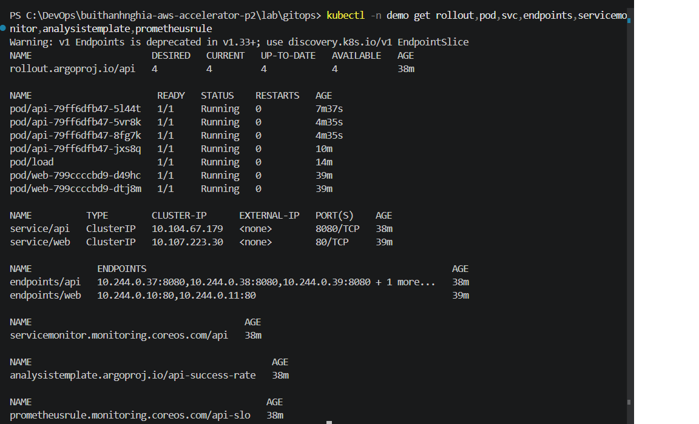
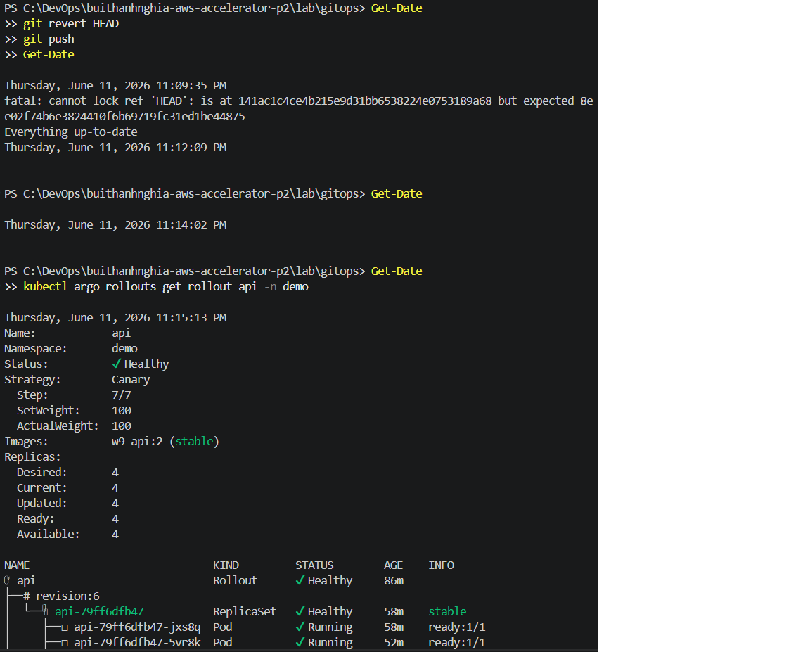
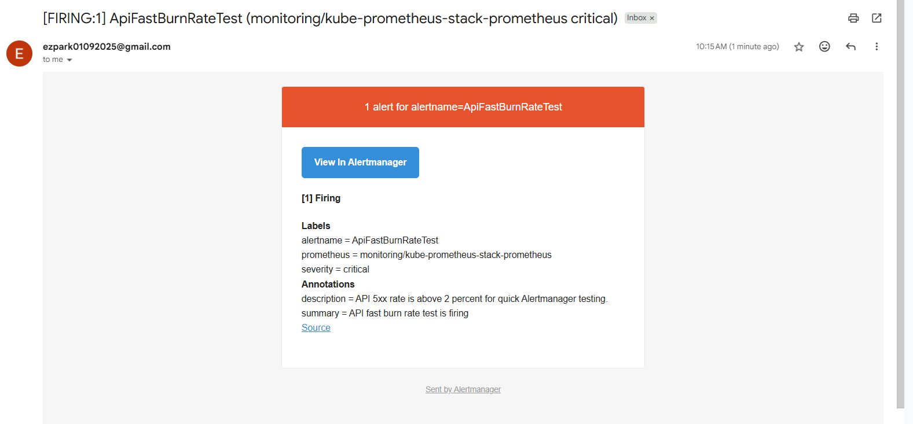

# Lab 5 - Observability và Canary Auto-Abort với Argo CD

## Mục tiêu

Lab triển khai API Flask trên Kubernetes bằng Argo CD, Prometheus và Argo Rollouts. Mục tiêu chính là chứng minh canary deployment tự đánh giá bằng metric: bản tốt được promote, bản lỗi bị auto-abort và giữ lại bản stable.

## Kiến trúc

```text
GitHub repo gitops
  -> Argo CD root Application
  -> argocd/apps/*
     -> web
     -> monitoring-extras
     -> kube-prometheus-stack
     -> argo-rollouts
     -> api

api Rollout -> expose /metrics
Prometheus -> scrape ServiceMonitor
Argo Rollouts -> query Prometheus bằng AnalysisTemplate
```

## Thành phần chính

| Thành phần | File | Vai trò |
| --- | --- | --- |
| Root app | `argocd/root.yaml` | App-of-apps, đọc các Application con trong `argocd/apps` |
| Prometheus stack | `argocd/apps/kube-prometheus-stack.yaml` | Cài Prometheus, Grafana, Alertmanager |
| Argo Rollouts | `argocd/apps/argo-rollouts.yaml` | Cài controller cho kind `Rollout` |
| API app | `argocd/apps/api.yaml` | Argo CD Application trỏ tới `k8s-api` |
| API workload | `k8s-api/api.yaml` | Rollout canary, Service `api` |
| Metrics | `k8s-api/servicemonitor.yaml` | Cho Prometheus scrape `/metrics` |
| Canary check | `k8s-api/analysis-template.yaml` | Success rate phải >= 95% |
| SLO alert | `k8s-api/prometheus-rule.yaml` | Burn-rate alert cho SLO 99.5% |

## Kết quả lab

- Argo CD quản lý toàn bộ app qua `root`.
- API chạy 4 replicas trong namespace `demo`.
- Prometheus scrape được metric `flask_http_request_total`.
- Bản tốt `w9-api:2` được canary từ 25% -> 50% -> 100%.
- Bản lỗi `w9-api:3` với `ERROR_RATE=0.8` bị `AnalysisRun` fail và auto-abort.
- Stable version vẫn giữ ở bản tốt sau khi bản lỗi bị abort.

## Lệnh kiểm tra chính

```powershell
kubectl -n argocd get applications
kubectl -n demo get rollout,pod,svc,endpoints,servicemonitor,analysistemplate,prometheusrule
kubectl -n monitoring get pod,svc
kubectl argo rollouts get rollout api -n demo
kubectl -n demo get analysisrun
```

Prometheus query dùng để kiểm chứng metric:

```promql
flask_http_request_total{namespace="demo", app="api"}
```

Query success rate trong `AnalysisTemplate`:

```promql
sum(rate(flask_http_request_total{namespace="demo", app="api", status!~"5.."}[1m]))
/
clamp_min(sum(rate(flask_http_request_total{namespace="demo", app="api"}[1m])), 1)
```

## Kịch bản demo

| Kịch bản | Cấu hình | Kết quả |
| --- | --- | --- |
| Bản tốt | `VERSION=v2`, `ERROR_RATE=0`, `image=w9-api:2` | Analysis thành công, rollout promote lên 100% |
| Bản lỗi | `VERSION=v3`, `ERROR_RATE=0.8`, `image=w9-api:3` | Analysis fail, rollout bị abort/degraded |

Load generator dùng để tạo traffic cho Prometheus:

```powershell
kubectl -n demo run load --image=busybox --restart=Never -- sh -c "while true; do wget -qO- http://api.demo.svc.cluster.local:8080/; sleep 1; done"
```

## Đối chiếu yêu cầu chấm

| Yêu cầu | Trạng thái | Evidence |
| --- | --- | --- |
| Thay đổi qua Git, Argo CD `Synced`, reproduce được từ Git | Đã có | Evidence 1 |
| `git revert` rollback dưới 5 phút | Cần bổ sung ảnh/output | Evidence 10 |
| Có SLO + alert fire về email cá nhân khi inject lỗi | Có rule; cần bổ sung ảnh alert/email | Evidence 8, Evidence 11 |
| Canary bản lỗi tự abort về bản cũ | Đã có | Evidence 7 |
| Repo có `Rollout`, `AnalysisTemplate`, SLO/alert qua Git | Đã có | Evidence 4, Evidence 8 |

## Evidence

### Evidence 1 - Argo CD Applications


### Evidence 2 - Prometheus target đã scrape API


### Evidence 3 - Prometheus query có dữ liệu

Chạy query:

```promql
flask_http_request_total{namespace="demo", app="api"}
```


### Evidence 4 - Kubernetes resources trong namespace demo

Chạy:

```powershell
kubectl -n demo get rollout,pod,svc,endpoints,servicemonitor,analysistemplate,prometheusrule
```



### Evidence 5 - Canary rollout đang chạy

Chạy:

```powershell
kubectl argo rollouts get rollout api -n demo
```

Nếu chưa có plugin:

```powershell
kubectl -n demo describe rollout api
kubectl -n demo get rs,pod -l app=api
```

Cần thấy:

- Canary revision mới.
- Stable revision cũ.
- 4 replicas ready.
- Bước canary 25% hoặc 50%.


### Evidence 6 - AnalysisRun thành công với bản tốt

Chạy:

```powershell
kubectl -n demo get analysisrun
kubectl -n demo describe analysisrun
```

Output:

```text
NAME                 STATUS       AGE
api-79ff6dfb47-2-2   Successful   2m23s
Name:         api-79ff6dfb47-2-2
Namespace:    demo
Labels:       app=api
              rollout-type=Step
              rollouts-pod-template-hash=79ff6dfb47
              step-index=2
Annotations:  rollout.argoproj.io/revision: 2
API Version:  argoproj.io/v1alpha1
Kind:         AnalysisRun
Metadata:
  Creation Timestamp:  2026-06-11T15:17:17Z
  Generation:          6
  Owner References:
    API Version:           argoproj.io/v1alpha1
    Block Owner Deletion:  true
    Controller:            true
    Kind:                  Rollout
    Name:                  api
    UID:                   7afdd695-0c5b-4a2c-9a8f-1e33e19d075e
  Resource Version:        5160
  UID:                     947a79c3-ed89-440c-8028-be792cfd85f6
Spec:
  Args:
    Name:   service-name
    Value:  api
  Metrics:
    Count:              4
    Failure Condition:  result[0] < 0.95
    Failure Limit:      1
    Initial Delay:      30s
    Interval:           30s
    Name:               success-rate
    Provider:
      Prometheus:
        Address:  http://kube-prometheus-stack-prometheus.monitoring.svc.cluster.local:9090
        Authentication:
          oauth2:
          sigv4:
        Query:  sum(rate(flask_http_request_total{namespace="demo", app="{{args.service-name}}", status!~"5.."}[1m]))
/
clamp_min(sum(rate(flask_http_request_total{namespace="demo", app="{{args.service-name}}"}[1m])), 1)

    Success Condition:  result[0] >= 0.95
Status:
  Completed At:  2026-06-11T15:19:17Z
  Dry Run Summary:
  Metric Results:
    Count:  4
    Measurements:
      Finished At:  2026-06-11T15:17:47Z
      Phase:        Successful
      Started At:   2026-06-11T15:17:47Z
      Value:        [1]
      Finished At:  2026-06-11T15:18:17Z
      Phase:        Successful
      Started At:   2026-06-11T15:18:17Z
      Value:        [1]
      Finished At:  2026-06-11T15:18:47Z
      Phase:        Successful
      Started At:   2026-06-11T15:18:47Z
      Value:        [1]
      Finished At:  2026-06-11T15:19:17Z
      Phase:        Successful
      Started At:   2026-06-11T15:19:17Z
      Value:        [1]
    Metadata:
      Resolved Prometheus Query:  sum(rate(flask_http_request_total{namespace="demo", app="api", status!~"5.."}[1m]))
/
clamp_min(sum(rate(flask_http_request_total{namespace="demo", app="api"}[1m])), 1)

    Name:        success-rate
    Phase:       Successful
    Successful:  4
  Phase:         Successful
  Run Summary:
    Count:       1
    Successful:  1
  Started At:    2026-06-11T15:17:17Z
Events:
  Type    Reason                 Age   From                 Message
  ----    ------                 ----  ----                 -------
  Normal  MetricSuccessful       23s   rollouts-controller  Metric 'success-rate' Completed. Result: Successful
  Normal  AnalysisRunSuccessful  23s   rollouts-controller  Analysis Completed. Result: Successful
```

### Evidence 7 - Auto-abort với bản lỗi

Sau khi deploy `ERROR_RATE=0.8`, chạy:

```powershell
kubectl argo rollouts get rollout api -n demo
kubectl -n demo get analysisrun
kubectl -n demo describe analysisrun
```


Auto abort output:


### Evidence 8 - PrometheusRule

Chạy:

```powershell
kubectl -n demo get prometheusrule api-slo -o yaml
```

```text
PS C:\DevOps\buithanhnghia-aws-accelerator-p2\lab\gitops> kubectl -n demo get prometheusrule api-slo -o yaml
apiVersion: monitoring.coreos.com/v1
kind: PrometheusRule
metadata:
  annotations:
    argocd.argoproj.io/tracking-id: api:monitoring.coreos.com/PrometheusRule:demo/api-slo
    prometheus-operator-validated: "true"
  creationTimestamp: "2026-06-11T14:48:21Z"
  generation: 1
  labels:
    app: api
  name: api-slo
  namespace: demo
  resourceVersion: "3557"
  uid: d495eff8-a7d7-4fa2-93ec-a48232d24e90
spec:
  groups:
  - name: api-slo
    rules:
    - alert: ApiFastBurnRate
      annotations:
        description: API is burning the 99.5 percent availability error budget too
          quickly.
        summary: API fast burn rate is too high
      expr: |
        (
          sum(rate(flask_http_request_total{namespace="demo", app="api", status=~"5.."}[5m]))
          /
          clamp_min(sum(rate(flask_http_request_total{namespace="demo", app="api"}[5m])), 1)
        ) > 0.072
        and
        (
          sum(rate(flask_http_request_total{namespace="demo", app="api", status=~"5.."}[1h]))
          /
          clamp_min(sum(rate(flask_http_request_total{namespace="demo", app="api"}[1h])), 1)
        ) > 0.072
      for: 2m
      labels:
        severity: critical
    - alert: ApiSlowBurnRate
      annotations:
        description: API is steadily consuming the 99.5 percent availability error
          budget.
        summary: API slow burn rate is elevated
      expr: |
        (
          sum(rate(flask_http_request_total{namespace="demo", app="api", status=~"5.."}[30m]))
          /
          clamp_min(sum(rate(flask_http_request_total{namespace="demo", app="api"}[30m])), 1)
        ) > 0.03
        and
        (
          sum(rate(flask_http_request_total{namespace="demo", app="api", status=~"5.."}[6h]))
          /
          clamp_min(sum(rate(flask_http_request_total{namespace="demo", app="api"}[6h])), 1)
        ) > 0.03
      for: 5m
      labels:
        severity: warning
```

### Evidence 09 - Rollback bằng git revert dưới 5 phút

Sau khi deploy bản lỗi, rollback bằng Git:

```powershell
git log --oneline -3
git revert HEAD
git push
```

Kiểm tra Argo CD và Rollout sau rollback:

```powershell
kubectl -n argocd get applications
kubectl argo rollouts get rollout api -n demo
```

Cần thấy:

- Commit lỗi đã được revert.
- App `api` quay về `Synced/Healthy`.
- Stable image quay lại bản tốt.
- Thời gian từ lúc revert đến lúc healthy nhỏ hơn 5 phút.




### Evidence 10 - Alert fire và gửi email

Sau khi inject lỗi, kiểm tra alert:

```powershell
kubectl -n monitoring port-forward svc/kube-prometheus-stack-prometheus 9090:9090
```

Mở Prometheus:

```text
http://localhost:9090/alerts
```

Email cá nhân nhận được từ Alertmanager.



