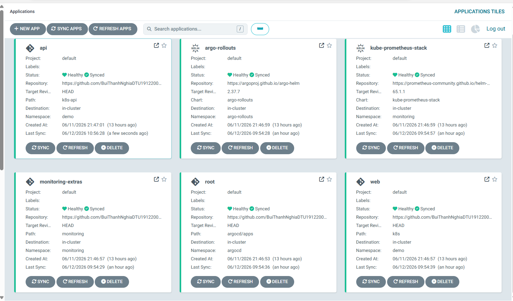
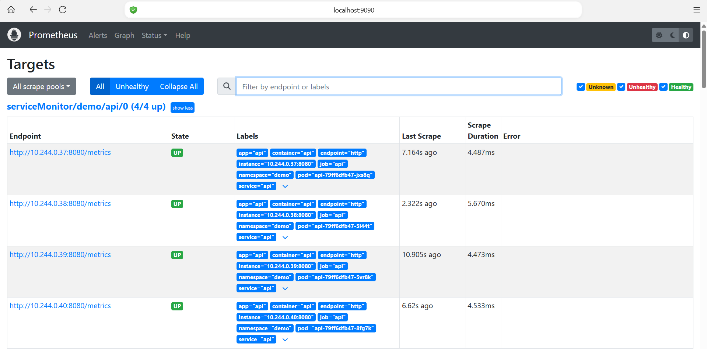
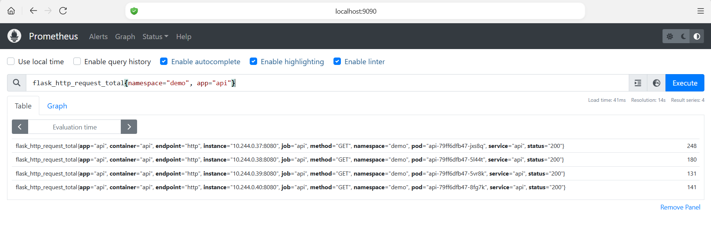
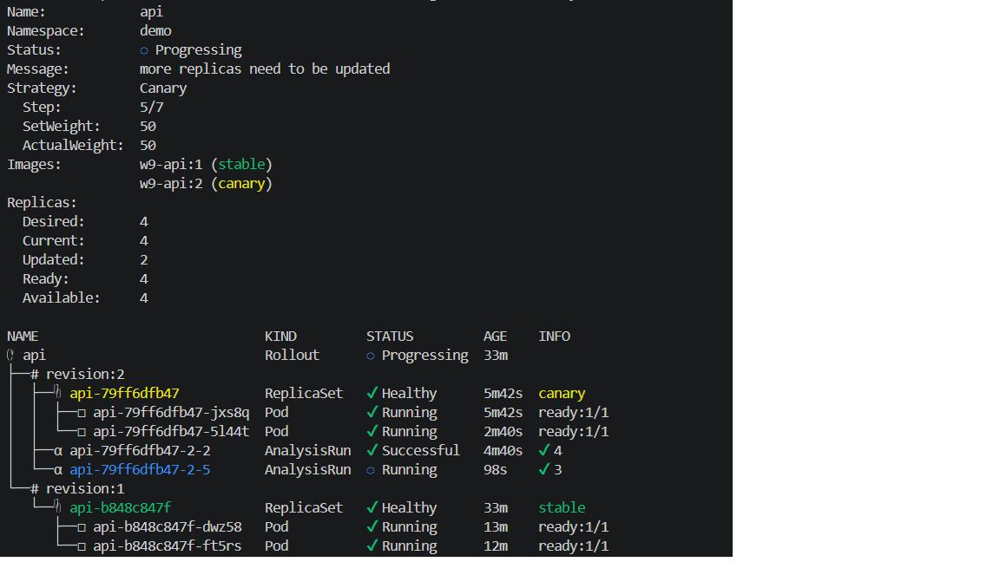
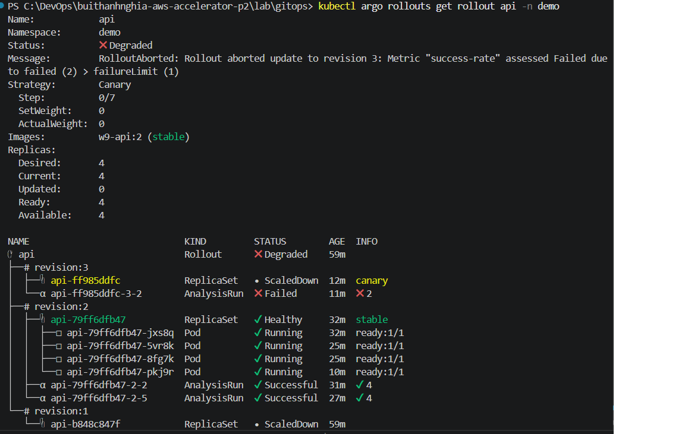

# Lab 5 - Observability và Canary Auto-Abort với Argo CD

## Mục tiêu

Lab này triển khai một API Flask bằng Argo Rollouts, expose metric `/metrics` cho Prometheus, sau đó dùng `AnalysisTemplate` để tự động đánh giá canary. Nếu metric tốt, rollout tiếp tục lên 100%. Nếu metric xấu, rollout bị abort và giữ lại bản stable.

## Kiến trúc

```text
GitHub repo gitops
  -> Argo CD root Application
  -> argocd/apps/
     -> monitoring-extras
     -> argo-rollouts
     -> kube-prometheus-stack
     -> api
  -> monitoring/
     -> Alertmanager SMTP secret
  -> k8s-api/
     -> Rollout api
     -> Service api
     -> ServiceMonitor api
     -> AnalysisTemplate api-success-rate
     -> PrometheusRule api-slo

Prometheus scrape /metrics từ Service api
Argo Rollouts query Prometheus để quyết định promote hoặc abort
```

## Các thành phần đã cấu hình

| Thành phần | File | Vai trò |
| --- | --- | --- |
| Root app | `argocd/root.yaml` | App-of-apps, đọc các Application con trong `argocd/apps` |
| Monitoring extras | `argocd/apps/monitoring-extras.yaml`, `monitoring/` | Tạo namespace/secret SMTP cho Alertmanager |
| Argo Rollouts | `argocd/apps/argo-rollouts.yaml` | Cài controller Rollout và CRD |
| Prometheus stack | `argocd/apps/kube-prometheus-stack.yaml` | Cài Prometheus, Grafana, Alertmanager và receiver email |
| API app | `argocd/apps/api.yaml` | Argo CD Application trỏ tới `k8s-api` |
| Rollout + Service | `k8s-api/api.yaml` | Chạy API bằng canary strategy và expose Service `api` |
| Mini FE/BE demo | `app/app.py`, `app/templates/counter.html` | FE ở `/app`, BE counter API ở `/api/status` và `/api/counter` |
| ServiceMonitor | `k8s-api/servicemonitor.yaml` | Cho Prometheus scrape `api:8080/metrics` |
| AnalysisTemplate | `k8s-api/analysis-template.yaml` | Query Prometheus, success rate phải >= 95% |
| PrometheusRule | `k8s-api/prometheus-rule.yaml` | Tạo alert burn-rate cho SLO 99.5% |

## Trạng thái mong đợi

Sau khi sync thành công:

- Argo CD hiển thị `root`, `monitoring-extras`, `api`, `argo-rollouts`, `kube-prometheus-stack` là `Healthy`.
- Prometheus `Status -> Targets` có target `serviceMonitor/demo/api/0`.
- Target API có state `UP`.
- Query Prometheus `flask_http_request_total{namespace="demo", app="api"}` trả về dữ liệu.
- Rollout `api` có 4 replicas ready.
- Khi deploy bản mới, rollout đi qua 25% -> analysis -> 50% -> analysis -> 100%.
- Khi deploy bản lỗi, analysis fail và rollout bị abort.
- Khi inject lỗi đủ lâu, `PrometheusRule` fire và Alertmanager gửi email.

## Chuẩn bị image API

Nếu dùng kind/local cluster, build image:

```powershell
docker build -t w9-api:1 .\app
```

Nếu cluster cần load image vào node local:

```powershell
kind load docker-image w9-api:1
```

Nếu không dùng kind, push image lên registry và sửa `image:` trong `k8s-api/api.yaml`.

## Cấu hình email Alertmanager

Trước khi sync phần monitoring, thay placeholder bằng thông tin email thật:

- `argocd/apps/kube-prometheus-stack.yaml`
  - `CHANGE_ME_EMAIL@gmail.com`
- `monitoring/alertmanager-smtp-secret.yaml`
  - `CHANGE_ME_APP_PASSWORD`

Với Gmail, giá trị `smtp-password` nên là App Password, không dùng mật khẩu đăng nhập chính.

## Kiểm tra mini FE/BE

App vẫn giữ các endpoint cũ `/`, `/healthz` và `/metrics`. Backend route nằm trong `app/app.py`, giao diện demo nằm ở `app/templates/counter.html` và được mở qua `/app`; nút bấm trên giao diện gọi backend API để tăng bộ đếm in-memory.

Port-forward Service API:

```powershell
kubectl -n demo port-forward svc/api 8080:8080
```

Mở giao diện:

```text
http://localhost:8080/app
```

Kiểm tra backend counter API:

```powershell
curl http://localhost:8080/api/status
curl http://localhost:8080/api/counter
curl -X POST http://localhost:8080/api/counter
```

Lưu ý: vì Rollout đang chạy nhiều replica, bộ đếm demo này là in-memory theo từng pod, không phải dữ liệu dùng chung toàn cluster.

## Deploy qua GitOps

Commit và push thay đổi lên repo GitHub:

```powershell
git add .gitignore argocd/apps/monitoring-extras.yaml argocd/apps/argo-rollouts.yaml argocd/apps/kube-prometheus-stack.yaml monitoring k8s-api/api.yaml k8s-api/servicemonitor.yaml k8s-api/analysis-template.yaml k8s-api/prometheus-rule.yaml README.md
git commit -m "complete lab 5 observability canary"
git push
```

Sau đó vào Argo CD và sync `root`, hoặc sync riêng các app:

- `argo-rollouts`
- `monitoring-extras`
- `kube-prometheus-stack`
- `api`

## Kiểm tra sau khi sync

Kiểm tra Argo CD Applications:

```powershell
kubectl -n argocd get applications
```

Kiểm tra namespace `demo`:

```powershell
kubectl -n demo get rollout,pod,svc,endpoints,servicemonitor,analysistemplate,prometheusrule
```

Kiểm tra Prometheus stack:

```powershell
kubectl -n monitoring get pod,svc
```

Mở Prometheus:

```powershell
kubectl -n monitoring port-forward svc/kube-prometheus-stack-prometheus 9090:9090
```

Truy cập:

```text
http://localhost:9090
```

Vào `Status -> Targets`, tìm:

```text
serviceMonitor/demo/api/0
```

Query metric:

```promql
flask_http_request_total{namespace="demo", app="api"}
```

Query traffic rate:

```promql
sum(rate(flask_http_request_total{namespace="demo", app="api"}[1m]))
```

Query success rate dùng cho AnalysisTemplate:

```promql
sum(rate(flask_http_request_total{namespace="demo", app="api", status!~"5.."}[1m]))
/
clamp_min(sum(rate(flask_http_request_total{namespace="demo", app="api"}[1m])), 1)
```

## Tạo traffic cho API

Nếu pod `load` chưa tồn tại:

```powershell
kubectl -n demo run load --image=busybox --restart=Never -- sh -c "while true; do wget -qO- http://api.demo.svc.cluster.local:8080/; sleep 1; done"
```

Nếu báo `AlreadyExists`, kiểm tra pod cũ:

```powershell
kubectl -n demo get pod load
kubectl -n demo logs load
```

Nếu pod cũ lỗi, xóa và tạo lại:

```powershell
kubectl -n demo delete pod load
kubectl -n demo run load --image=busybox --restart=Never -- sh -c "while true; do wget -qO- http://api.demo.svc.cluster.local:8080/; sleep 1; done"
```

## Theo dõi Rollout

Nếu đã cài plugin `kubectl-argo-rollouts`:

```powershell
kubectl argo rollouts get rollout api -n demo --watch
```

Nếu chưa có plugin, dùng kubectl thường:

```powershell
kubectl -n demo get rollout api -w
```

Xem chi tiết:

```powershell
kubectl -n demo describe rollout api
kubectl -n demo get analysisrun
kubectl -n demo describe analysisrun
```

## Kịch bản 1 - Bản tốt được promote

Sửa `k8s-api/api.yaml`:

```yaml
- { name: ERROR_RATE, value: "0" }
- { name: VERSION,    value: "v2" }
```

Commit và push:

```powershell
git add k8s-api/api.yaml
git commit -m "deploy api v2 healthy canary"
git push
```

Sync app `api` trên Argo CD.

Kết quả mong đợi:

- Rollout tạo revision mới.
- Canary lên 25%.
- `AnalysisTemplate` query Prometheus.
- Success rate >= 95%.
- Rollout tiếp tục lên 50% rồi 100%.

## Kịch bản 2 - Bản lỗi bị auto-abort

Sửa `k8s-api/api.yaml`:

```yaml
- { name: ERROR_RATE, value: "0.8" }
- { name: VERSION,    value: "v3" }
```

Commit và push:

```powershell
git add k8s-api/api.yaml
git commit -m "deploy api v3 bad canary"
git push
```

Sync app `api` trên Argo CD.

Kết quả mong đợi:

- Canary tạo pod revision mới.
- Load traffic tạo nhiều response HTTP 500.
- Prometheus success rate thấp hơn 95%.
- `AnalysisRun` fail.
- Rollout bị abort và không promote bản lỗi lên 100%.

Rollback bằng Git:

```powershell
git revert HEAD
git push
```

Hoặc abort thủ công khi đang test:

```powershell
kubectl argo rollouts abort api -n demo
```

## Evidence cần nộp

### Evidence 1 - Argo CD Applications

Cần chụp:

- Màn hình tổng quan Argo CD có `root`, `api`, `argo-rollouts`, `kube-prometheus-stack`.
- Trạng thái tốt nhất: `Healthy`.
- `api` có thể tạm thời `OutOfSync` khi rollout đang pause/in-progress.

Chèn ảnh tại đây:

```markdown

```

### Evidence 2 - Prometheus target đã scrape API

Cần chụp:

- Prometheus `Status -> Targets`.
- Pool `serviceMonitor/demo/api/0`.
- Các endpoint `/metrics` có state `UP`.

Chèn ảnh tại đây:

```markdown

```

### Evidence 3 - Prometheus query có dữ liệu

Cần chạy query:

```promql
flask_http_request_total{namespace="demo", app="api"}
```

Hoặc:

```promql
sum(rate(flask_http_request_total{namespace="demo", app="api"}[1m]))
```

Chèn ảnh tại đây:

```markdown

```

### Evidence 4 - Kubernetes resources trong namespace demo

Chạy:

```powershell
kubectl -n demo get rollout,pod,svc,endpoints,servicemonitor,analysistemplate,prometheusrule
```

Chèn output hoặc ảnh terminal tại đây:

```text
PASTE OUTPUT HERE
```

### Evidence 5 - Canary rollout đang chạy

Chạy:

```powershell
kubectl argo rollouts get rollout api -n demo
```

Nếu chưa có plugin:

```powershell
kubectl -n demo describe rollout api
kubectl -n demo get rs,pod -l app=api
```

Cần thấy:

- Canary revision mới.
- Stable revision cũ.
- 4 replicas ready.
- Bước canary 25% hoặc 50%.

Chèn ảnh/output tại đây:

```markdown

```

### Evidence 6 - AnalysisRun thành công với bản tốt

Chạy:

```powershell
kubectl -n demo get analysisrun
kubectl -n demo describe analysisrun
```

Cần thấy metric `success-rate` thành công.

Chèn ảnh/output tại đây:

```text
PASTE OUTPUT HERE
```

### Evidence 7 - Auto-abort với bản lỗi

Sau khi deploy `ERROR_RATE=0.8`, chạy:

```powershell
kubectl argo rollouts get rollout api -n demo
kubectl -n demo get analysisrun
kubectl -n demo describe analysisrun
```

Cần thấy:

- `AnalysisRun` fail.
- Rollout bị abort/degraded.
- Bản lỗi không lên 100%.

Chèn ảnh/output tại đây:

```markdown

```

### Evidence 8 - PrometheusRule hoặc alert

Chạy:

```powershell
kubectl -n demo get prometheusrule api-slo -o yaml
```

Hoặc vào Prometheus `Alerts` để chụp rule.

Chèn ảnh/output tại đây:

```text
PASTE OUTPUT HERE
```

## Troubleshooting

### `kubectl` không kết nối được cluster

Nếu gặp lỗi dạng:

```text
Unable to connect to the server: dial tcp 127.0.0.1:<port>: connectex
```

Kiểm tra Docker Desktop hoặc local cluster có đang chạy không. Sau đó kiểm tra context:

```powershell
kubectl config current-context
kubectl config get-contexts
```

### Prometheus không thấy target API

Kiểm tra Service và ServiceMonitor:

```powershell
kubectl -n demo get svc api --show-labels
kubectl -n demo get servicemonitor api -o yaml
```

Điều kiện cần đúng:

- Service có label `app=api`.
- ServiceMonitor selector là `app=api`.
- Service port có tên `http`.
- ServiceMonitor endpoint dùng `port: http`.

### Query Prometheus rỗng

Kiểm tra load generator:

```powershell
kubectl -n demo get pod load
kubectl -n demo logs load
```

Nếu không có traffic, metric rate có thể rỗng hoặc bằng 0.

### Argo Rollouts plugin chưa cài

Nếu gặp:

```text
error: unknown command "argo" for "kubectl"
```

Có thể dùng các lệnh thay thế:

```powershell
kubectl -n demo get rollout api -w
kubectl -n demo describe rollout api
kubectl -n demo get analysisrun
```

### App `api` OutOfSync trong khi rollout

Trong lúc canary đang pause, đang analysis, hoặc chưa promote xong, app `api` có thể hiển thị `OutOfSync`. Nếu app vẫn `Healthy`, pod ready, Prometheus target UP, thì không phải lỗi nghiêm trọng. Sau khi rollout kết thúc 100% và sync lại, trạng thái nên về `Synced`.
